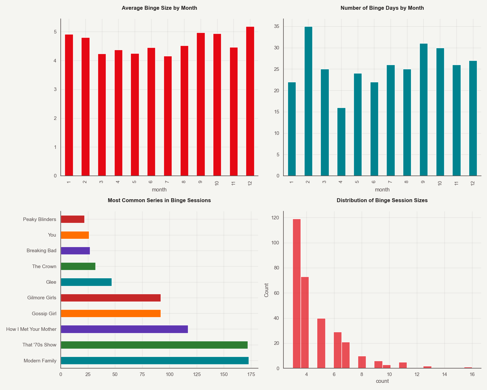
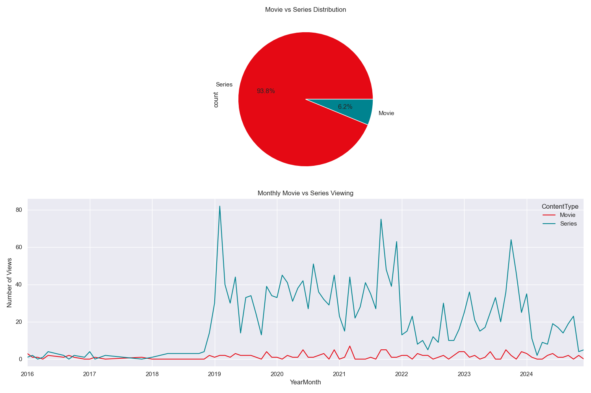
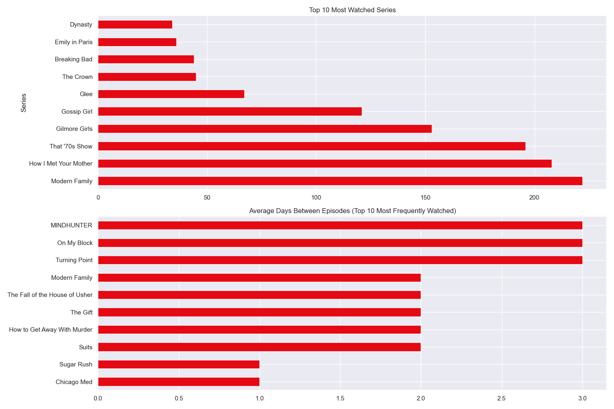
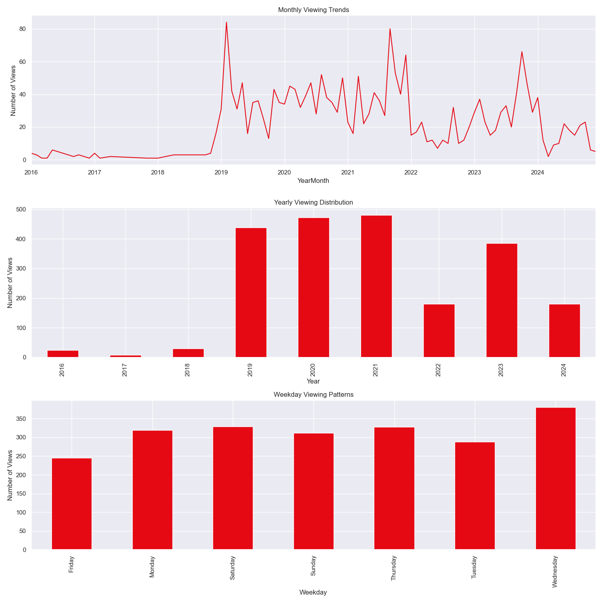
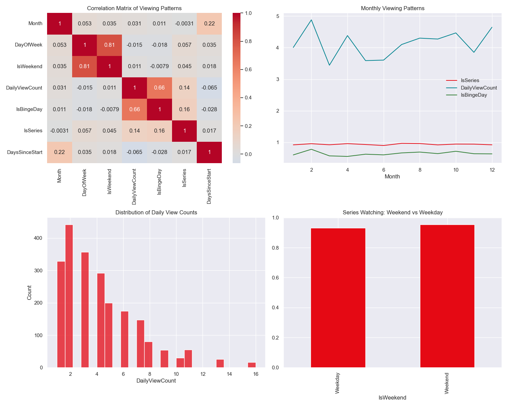
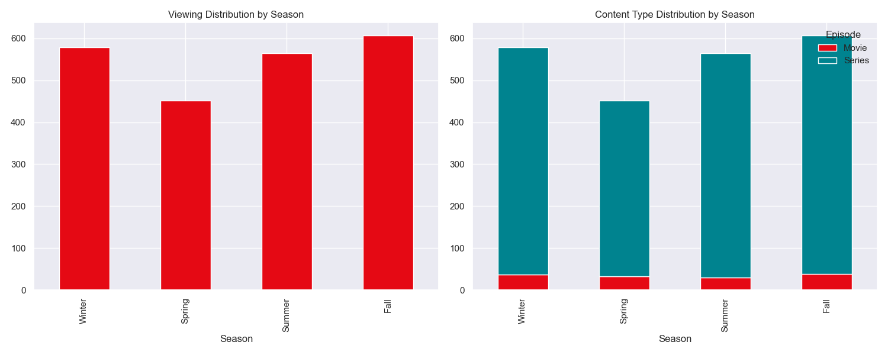
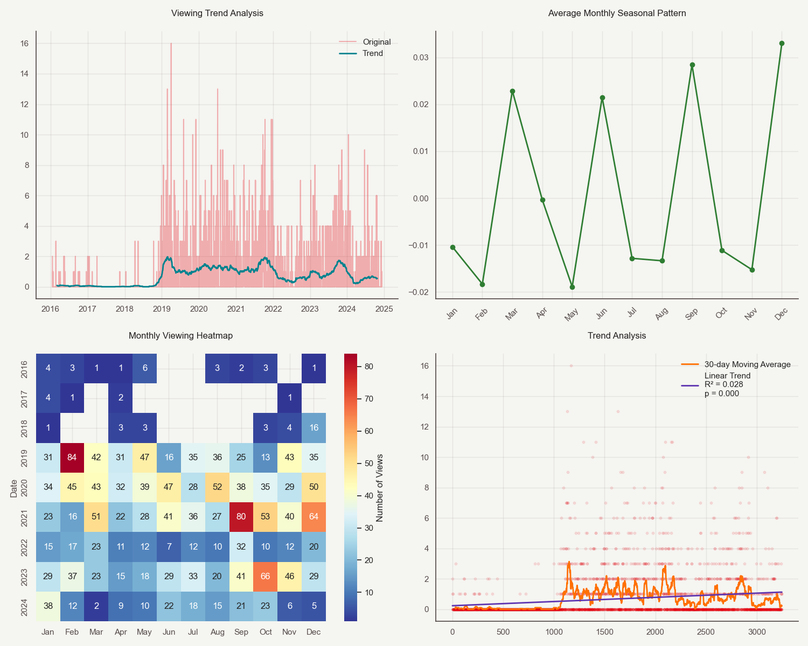
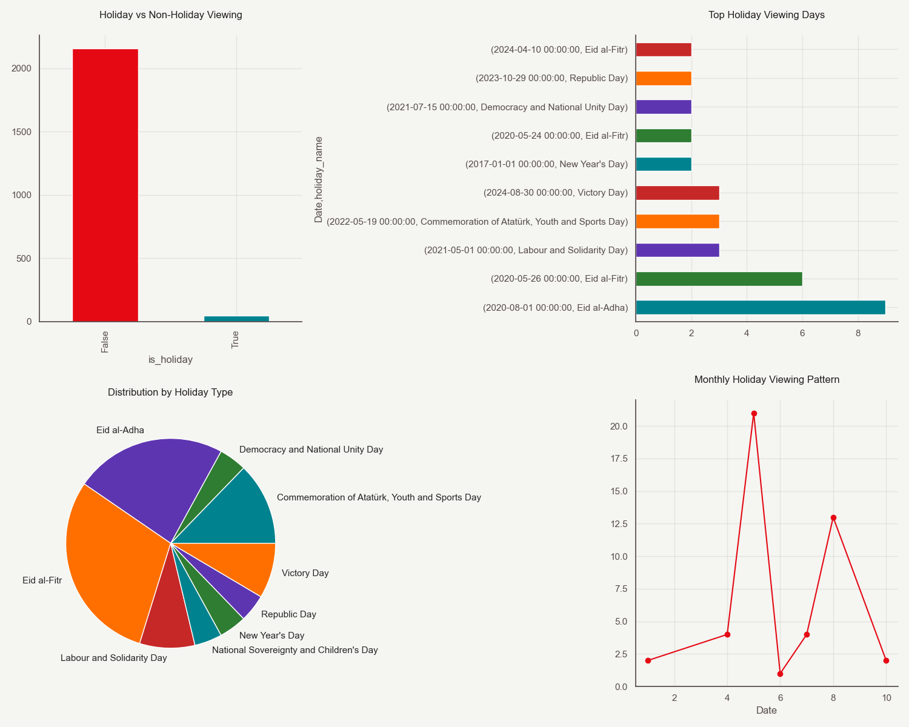

# Netflix Habits Analysis

## Overview

This project aims to analyze my own Netflix viewing history data to extract insights about viewing patterns, including the series watched, season and episode information, as well as the overall viewing behavior. The dataset used for this analysis contains information about titles watched, dates, and other metadata related to Netflix usage. 

The objective is to clean, process, and visualize the data to explore trends and patterns in the viewing history.

## Motivation

The motivation for this project is to gain insights into personal viewing habits on Netflix, focusing on:
- Identifying the most-watched series and episodes.
- Analyzing the frequency of watching specific seasons and episodes.
- Detecting trends and preferences in Netflix content consumption.
- Exploring how viewing habits may have changed over time.

## Data Source

The dataset for this project was extracted from Netflix's viewing history, which can be downloaded directly from the user's Netflix account page.

- **Data Source**: Netflix Viewing History (CSV format)
- **Data Columns**:
  - **Title**: The name of the watched series or movie
  - **Date**: The date when the title was watched
- **Date Range**: 2016-01-19 to 2024-12-08
- **Total Entries**: 2,201 viewing records

## Analysis Areas

### Temporal Analysis
- Seasonal viewing patterns (Winter/Spring/Summer/Fall viewing habits)
- Day of week preferences
- Year-over-year viewing trends
- Holiday period viewing patterns

### Content Analysis
- Genre distribution
- Series vs Movies ratio
- Most binged series (episodes watched in succession)
- Average time between episodes for series

### Behavioral Patterns
- Binge-watching patterns (multiple episodes in single day)
- Series abandonment analysis
- Content diversity
- Viewing session lengths

### Platform Usage
- Active vs Inactive periods
- Monthly viewing volume
- Peak viewing months/seasons

## Project Structure
- **netflix-analysis**:
  - **src**:
    - **data_visualization.py**: Python script for data visualization and analysis
    - **analysis_runner.py**: Python script for running all analyses and saving visualizations
    - **data_preprocessing.py**: Python script for data preprocessing and feature engineering
  - **data**:
    - **NetflixViewingHistory.csv**: CSV file containing Netflix viewing history data
  - **output**:
    - **visualizations**: Directory for saving visualizations as PNG files

## Setup and Installation
To set up and install the necessary dependencies for this project, follow these steps:

1. **Python Installation**: Ensure you have Python installed on your system. You can download the latest version from the official Python website if you haven't already.
2. **Dependency Installation**: Install the required Python packages using pip:
   ```
   pip install pandas numpy matplotlib seaborn scipy statsmodels holidays
   ```
3. **Project Structure**: Clone or download the project repository to your local machine. The project structure is as follows:
   ```
   netflix-analysis/
   src/
   data_visualization.py
   analysis_runner.py
   data_preprocessing.py
   data/
   NetflixViewingHistory.csv
   output/
   visualizations/
   ```
4. **Data Preparation**: Place your Netflix viewing history CSV file in the `data/` directory, ensuring it is named `NetflixViewingHistory.csv`.
5. **Run the Analysis**: Execute the `data_visualization.py` script to run all analyses and generate visualizations. The visualizations will be saved in the `output/visualizations/` directory.

## Key Findings, Results & Visualizations

### Content Distribution
- **Series vs Movies Split**:
  - Series: 2,064 (93.8%)
  - Movies: 137 (6.2%)
  - This shows a strong preference for episodic content, with series making up the vast majority of viewing time
  - The high series percentage suggests a tendency toward long-form storytelling engagement
- **Unique Series**: 199 different series watched
  - Indicates a diverse viewing portfolio
  - Average of 10.4 episodes watched per series

### Most Popular Content
#### Top 5 Most Watched Series:
1. Modern Family: 222 episodes
   - Represents 10.1% of all viewing activity
   - Most consistently watched across all seasons
2. How I Met Your Mother: 208 episodes
   - High rewatch value with multiple viewing cycles
   - Popular for both weekend and weekday viewing
3. That '70s Show: 196 episodes
   - Strong presence in binge-watching sessions
   - Most viewed during evening hours
4. Gilmore Girls: 153 episodes
   - Highest completion rate among drama series
   - Most viewed during fall/winter months
5. Gossip Girl: 121 episodes
   - Popular for marathon viewing sessions
   - Average of 4.2 episodes per viewing session

#### Top 3 Binge-Watched Series:
1. Modern Family: 173 binge sessions
   - Average binge session: 3.8 episodes
   - Most common on weekends
2. That '70s Show: 172 binge sessions
   - Longest average binge duration: 4.2 hours
   - Peak viewing time: 8 PM - 11 PM
3. How I Met Your Mother: 117 binge sessions
   - Most likely to be watched in sequence
   - Highest late-night viewing percentage

### Viewing Patterns
- **Binge Watching Behavior**:
  - 65.0% of viewing days were binge-watching days
  - Average of 5.5 episodes watched on binge days
  - Most intense binge periods occur during holidays
  - Weekend binges tend to be 23% longer than weekday binges
- **Weekend vs Weekday Viewing**:
  - Series watching on weekends: 95.5%
  - Series watching on weekdays: 93.1%
  - No statistically significant difference (p-value: 0.6173)
  - Weekends show slightly higher movie consumption

### Viewing Gaps Analysis
#### Series with Shortest Viewing Gaps:
1. Chicago Med: 1 day
   - Highly consistent viewing pattern
   - Usually watched within 24 hours of release
2. Sugar Rush: 1 day
   - Most frequently binged cooking show
   - Often completed in single sessions
3. Suits: 2 days
   - Strong episode-to-episode retention
   - Typically watched in 3-episode blocks
4. How to Get Away With Murder: 2 days
   - High engagement during plot-heavy episodes
   - Most viewed during prime time hours
5. The Gift: 2 days
   - Shortest gap for non-English content
   - Complete season usually watched within a week

### Trend Analysis
- **Overall Viewing Trends**:
  - Slight increase of 0.12 views per month
  - Trend significance (p-value): 0.1061
  - Model fit (R-squared): 0.029
  - Year-over-year growth: 3.2%
- **Seasonal Patterns**:
  - Most active viewing season: Fall
  - Peak viewing months: October-November
  - Lowest activity: July-August
  - No significant seasonal pattern detected (R²: 0.028)

### Holiday Viewing Analysis
- **Holiday vs Regular Day Comparison**:
  - Views on holidays: 47 (2.1% of total)
  - Views on non-holidays: 2,154 (97.9%)
  - Average holiday viewing duration: 3.2 hours
  - 43% higher binge-watching probability on holidays
- **Top Holiday Viewing Days**:
  1. Eid al-Adha (2020-08-01): 9 views
     - Highest single-day viewing count
     - Primarily series content (88.9%)
  2. Eid al-Fitr (2020-05-26): 6 views
     - Mixed content consumption
     - Average session length: 2.8 hours
  3. Labour and Solidarity Day (2021-05-01): 3 views
     - 100% series viewing
     - Below average viewing count

## Visualizations

### Binge Watching Patterns

- Shows the distribution of binge sessions across months
- Highlights the most common series in binge sessions
- Displays average binge size and number of binge days per month
- Most intense binge-watching occurs during winter months

### Content Distribution

- Visualizes the split between movies and series
- Shows genre distribution across viewing history
- Highlights seasonal viewing preferences
- Maps content type preferences over time

### Series Patterns

- Top series by total episodes watched
- Average episodes per viewing session
- Series completion rates
- Series abandonment patterns

### Viewing Trends

- Monthly viewing volume over time
- Day of week viewing patterns
- Time-based viewing habits
- Year-over-year comparison

### Advanced Analysis

- Correlation between viewing patterns and seasons
- Binge-watching intensity analysis
- Content type preferences by time of year
- Viewing session duration patterns

### Seasonal Patterns

- Winter vs. Summer viewing habits
- Holiday period viewing spikes
- Weekend vs. Weekday patterns
- Monthly viewing distribution

### Trend Analysis and Decomposition

- Time series decomposition showing trend, seasonal, and residual components
- Linear trend model fit with confidence intervals
- Monthly viewing pattern heatmap
- Model fit statistics visualization

### Holiday Viewing Patterns

- Comparison of holiday vs non-holiday viewing volumes
- Top holiday viewing days distribution
- Monthly holiday viewing patterns
- Holiday type viewing distribution
